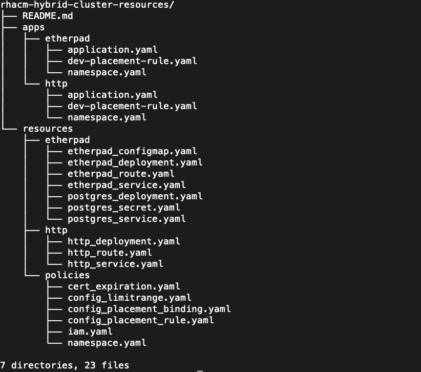

# HOW TO MANAGE A HYBRID CLUSTER (CONSISTING OF BOTH INTEL AND ARM NODES) USING RED HAT ADVANCED CLUSTER MANAGEMENT FOR KUBERNETES 

## 1. INTRODUCTION

This is the repository hosting the resources used in the "How to Manage a Hybrid Cluster using RHACM" Video series. The resources are used in creating applications/deploying from RHACM to managed Kubernetes/Openshift clusters and setting/enforcing policies.

## 2. DEMO VIDEO

The videos using these resources are listed below:
* How to to Manage a Hybrid Cluster Using RHACM Video Part 2 - Cluster Lifecycle 

* How to to Manage a Hybrid Cluster Using RHACM Video Part 3 - Application Lifecycle 

* How to to Manage a Hybrid Cluster Using RHACM Video Part 4 - Governance, Risk and Compliance 

## 3. RESOURCE ORGANISATION
The directory structure of the resources in this repository is shown below: 

The applications deployed are:
* http - an application to run on an ARM node
* etherpad - an application to run on an Intel node

For the deployment to work:
* when you import the Openshift cluster, set env=dev; add label: cluster=openshift
* when importing the hybrid Kubernetes cluster, set env=dev; add labels: cluster=hybrid, ingress=traefik
* run the following command on the hybrid cluster for all ARM nodes. In my hybrid cluster, "k3s-node1" is the only ARM node in my hybrid cluster.

<pre><code>
kubectl taint nodes k3s-node1 kubernetes.io/arch=arm64:NoSchedule
</code></pre>
## 4. References
For more information, please refer to the following links:
* [Cluster Lifecycle](https://access.redhat.com/documentation/en-us/red_hat_advanced_cluster_management_for_kubernetes/2.2/html-single/manage_cluster/index#managing-your-clusters)
* [Application Lifecycle](https://access.redhat.com/documentation/en-us/red_hat_advanced_cluster_management_for_kubernetes/2.2/html-single/manage_applications/index#application-model-and-definitions)
* [Governance, Risk and Compliance](https://access.redhat.com/documentation/en-us/red_hat_advanced_cluster_management_for_kubernetes/2.2/html-single/security/index#governance-and-risk)
* [End-to-end Visibility](https://access.redhat.com/documentation/en-us/red_hat_advanced_cluster_management_for_kubernetes/2.2/html-single/web_console/index#observability-in-the-console)

## ENJOY ;-) !!! 